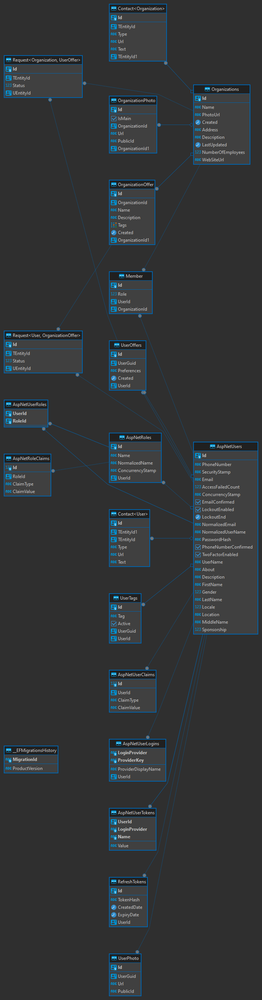

# NoSolo API
<table width="100%" border="0">
  <tr>
    <td valign="center">
      
    </td>
    <td valign="center" align="center">
      
      
      
      
      
      
      
      
      
      
      
    </td>
</tr>
</table>

### Tech Stack
- .NET 7.0
- EntityFramework Core, Mapper (Dependency Injection)
- PostgreSQL, Redis

### Database structure

#### Main database diagram

#### Feed back database diagram

