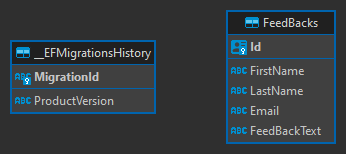

# NoSolo API

### Tech Stack
- .NET 7.0
- EntityFramework Core, Mapper (Dependency Injection)
- PostgreSQL, Redis

### Database structure

#### Main database diagram

#### Feed back database diagram

